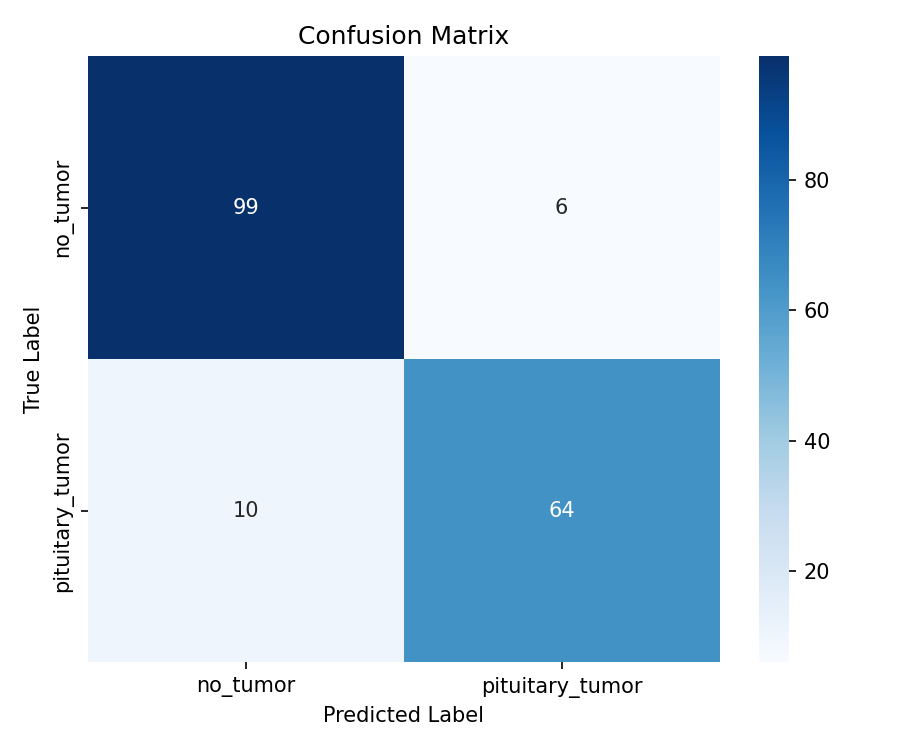
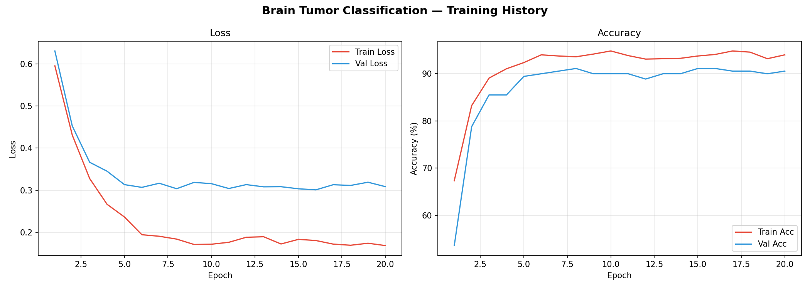
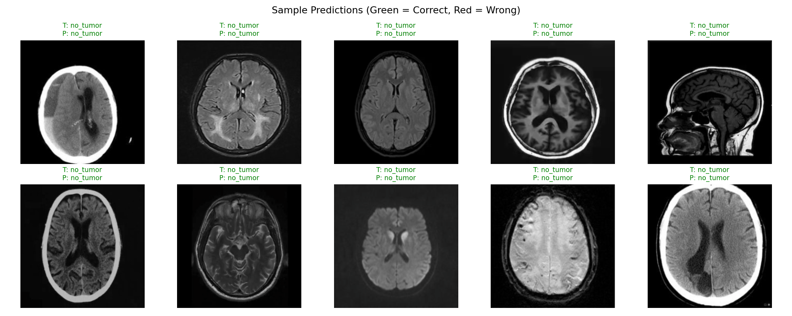

#  Brain Tumor Classification (Pituitary Tumor vs. No Tumor)

A deep learning project that classifies brain MRI scans as **pituitary tumor** or **no tumor** using transfer learning with **ResNet18** in **PyTorch**. It includes a training/evaluation pipeline and a dark-themed **Tkinter desktop GUI** for running predictions on your own images.

>  **Disclaimer:** This project is for educational and research purposes only. It is **not** a medical device and must not be used for clinical diagnosis or treatment decisions.

---

##  Features

- Transfer learning with an ImageNet-pretrained **ResNet18** (frozen backbone, custom classification head)
- Data augmentation (horizontal flip, rotation, color jitter)
- Automatic best-model checkpointing based on validation accuracy
- Training curves, confusion matrix, classification report and sample prediction plots
- Desktop GUI with image preview, prediction, confidence score and animated confidence bar

---

##  Results

Evaluated on the held-out test set (179 images):

| Metric | Value |
|---|---|
| **Test Accuracy** | **~91.1%** (163 / 179 correct) |

| Class | Precision | Recall | F1-score | Support |
|---|---|---|---|---|
| no_tumor | 0.91 | 0.94 | 0.93 | 105 |
| pituitary_tumor | 0.91 | 0.86 | 0.89 | 74 |

### Confusion Matrix



### Training History



### Sample Predictions



---

##  Model Architecture

- **Backbone:** ResNet18 pretrained on ImageNet (all layers frozen)
- **Custom head:**
  ```
  Dropout(0.4) → Linear(512, 256) → ReLU → Dropout(0.3) → Linear(256, 2)
  ```
- **Loss:** CrossEntropyLoss
- **Optimizer:** Adam (`lr=1e-4`, `weight_decay=1e-5`) on the head only
- **Scheduler:** StepLR (`step_size=7`, `gamma=0.1`)

### Hyperparameters

| Parameter | Value |
|---|---|
| Image size | 224 × 224 |
| Batch size | 32 |
| Epochs | 20 |
| Learning rate | 1e-4 |
| Classes | 2 (`no_tumor`, `pituitary_tumor`) |

---

##  Project Structure

```
brain-tumor-classification/
├── brain_tumor_classification.py   # Training + evaluation script
├── brain_tumor_gui.py              # Tkinter prediction app
├── best_brain_tumor_model.pth      # Saved weights (generated after training)
├── images/
│   ├── confusion_matrix.png
│   ├── sample_predictions.png
│   └── training_curves.png
├── dataset/                        # Extracted dataset (not tracked in git)
│   ├── Training/
│   │   ├── no_tumor/
│   │   └── pituitary_tumor/
│   └── Testing/
│       ├── no_tumor/
│       └── pituitary_tumor/
├── requirements.txt
└── README.md
```

---

##  Installation

```bash
# 1. Clone the repository
git clone https://github.com/<your-username>/<your-repo-name>.git
cd <your-repo-name>

# 2. (Optional) create a virtual environment
python -m venv venv
venv\Scripts\activate        # Windows
# source venv/bin/activate   # macOS / Linux

# 3. Install dependencies
pip install -r requirements.txt
```

### `requirements.txt`

```
torch
torchvision
numpy
matplotlib
seaborn
scikit-learn
pillow
```

---

##  Dataset

The dataset is **not** included in this repository. Download a brain MRI dataset containing `pituitary` and `no_tumor` classes (e.g. from Kaggle) and place the zip file in the project folder.

The script expects the following structure after extraction:

```
dataset/
├── Training/
│   ├── no_tumor/
│   └── pituitary_tumor/
└── Testing/
    ├── no_tumor/
    └── pituitary_tumor/
```

Then update `ZIP_PATH` at the top of `brain_tumor_classification.py`:

```python
ZIP_PATH = r"path\to\archive.zip"   # use a raw string (r"...") on Windows
```

> 📎 **Dataset source:** _add the link to the dataset you used here._

---

##  Usage

### 1. Train the model

```bash
python brain_tumor_classification.py
```

This will:
1. Extract the dataset (if not already extracted)
2. Train the model for 20 epochs
3. Save the best weights to `best_brain_tumor_model.pth`
4. Save `training_curves.png`, `confusion_matrix.png` and `sample_predictions.png`
5. Print the test accuracy and classification report

> A CUDA GPU is used automatically if available; otherwise training runs on CPU.

### 2. Launch the GUI

```bash
python brain_tumor_gui.py
```

1. Click **Choose MRI Image** and select a scan (`.jpg`, `.jpeg`, `.png`, `.bmp`, `.tiff`)
2. Click **Analyze & Predict**
3. View the diagnosis and confidence score

---

##  Limitations

- Binary classification only (pituitary tumor vs. no tumor); other tumor types are not covered
- The test set is used for model selection (best-epoch checkpointing), so the reported accuracy may be slightly optimistic. A separate validation split is recommended for rigorous evaluation
- Recall for the tumor class (~86%) means some tumors are missed — unacceptable for real clinical use
- Only the classification head is trained; fine-tuning deeper layers may improve results

##  Future Improvements

- Fine-tune the later ResNet layers (unfreeze `layer4`)
- Add a proper train / validation / test split
- Extend to multi-class classification (glioma, meningioma, pituitary, no tumor)
- Add Grad-CAM visualizations for explainability
- Try EfficientNet or Vision Transformers
- Package the model as a web app (Streamlit / Gradio)

---

##  Tech Stack

Python · PyTorch · torchvision · scikit-learn · Matplotlib · Seaborn · Pillow · Tkinter

---

##  License

This project is licensed under the MIT License — see the [LICENSE](LICENSE) file for details.

##  Acknowledgements

- [PyTorch](https://pytorch.org/) and torchvision for the pretrained ResNet18
- The authors of the MRI dataset used for training

---

⭐ If you found this project useful, consider giving it a star!
